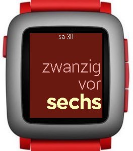
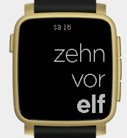
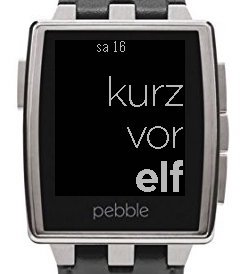
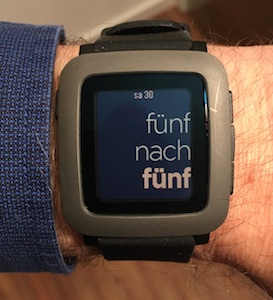
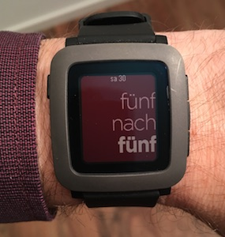
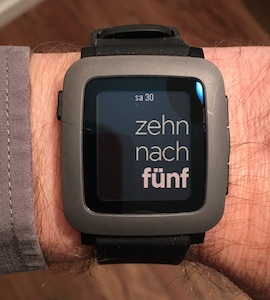
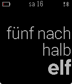

# German Pebble Watchface

This is is a watchface for the Pebble smartwatch that shows the current time in German.

The time is shown in colloquial, "fuzzy" mode: We say "Viertel nach 10" when it's only 10:12, or already 10:17.

Several color themes are available (selected with the configuration dialog in your phone's Pebble app). More to be added on request, or when I get more shirts.

A battery icon is displayed in the upper left corner when charge drops to 10 % or below. A Bluetooth icon is displayed in the upper right corner when the Bluetooth connection is lost. To give the watchface a clean, minimalistic look, both icons are shown only when necessary.

The watchface is based on https://github.com/n3v3r001/n3v3rstextone, with the overall design and most of the source code unchanged. Both use the same settings dialog and share settings when installing one over the other on the watch. I applied the following changes (refer to the git log for details):

* Add fuzzy mode (the original would give the exact time, e. g. "sieben nach halb elf")
* Align text to the right (since I wear the watch on the left wrist, and the left side of the watch is frequently covered by the shirt sleeve)
* Add color themes for blue, red, and white background
* Show battery icon in red when < 10 %
* Show battery icon only when < 10 %
* Show Bluetooth icon only when offline
* Migrate to Pebble SDK 3
* Change the name from ""n3v3rs text one" to "Deutsch"

To install the watchface on your Pebble, use the Pebble SDK as described on https://developer.pebble.com/tutorials/watchface-tutorial/part1/.

Planned future changes:

* Configuration options to enable/disable the changes I made to the original
* Make it available in the Pebble store